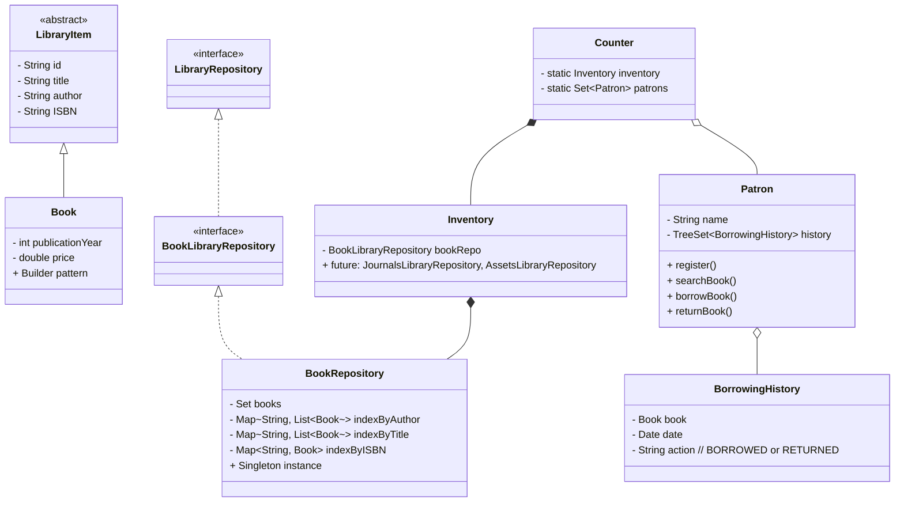

# 📚 Library Management System (Console-based)

A console-based **Library Management System** assignment project (Airtribe) showcasing **SOLID principles, design patterns, and clean architecture practices**.  
The system is designed to be **extensible**, supporting not only books but also future assets like **journals, magazines, and physical resources**.

---

## 🚀 Features

- **Admin Operations**
    - Add, update, remove books
    - View available books
    - View borrowed books

- **Patron (User) Operations**
    - Register and login as a patron
    - Search books (by Title, Author, ISBN)
    - Borrow and return books
    - View borrowing history (sorted by date)

- **Inventory Management**
    - Centralized `Inventory` accessed by multiple counters
    - Fast lookups using HashMaps for title, author, and ISBN
    - Singleton repository for consistent data storage

---

## 🏛️ System Design

### 1. Core Entities
- **LibraryItem (abstract class)** → Base class for all library items.
- **Book extends LibraryItem** → Represents a book (with Builder Pattern for object creation).

### 2. Repository Layer
- **LibraryRepository (Interface)** → Abstraction for all repositories.
- **BookLibraryRepository (Interface)** → Extension for book-specific operations.
- **BookRepository (Singleton)** → Implements `BookLibraryRepository`. Stores books in a **Set** (avoids duplicates). Also maintains **HashMaps** for faster search by title, author, and ISBN.

### 3. Inventory
- `Inventory` holds references to different repositories:
    - `BookLibraryRepository` (current)
    - Future: `AssetsLibraryRepository`, `JournalsLibraryRepository`
- Promotes **composition** for scalability.

### 4. Counter
- `Counter` is a **static shared access point** for the inventory.
- Multiple counters can access the **same Inventory** (simulating real library desks).

### 5. Patron Management
- `Patron` class represents library users.
- `Counter` uses a **static HashSet** to persist patron records.
- Patrons can register, search, borrow, return, and view borrowing history.

### 6. Borrowing History
- Each Patron has a **TreeSet** of `BorrowingHistory`.
- Ensures **sorted order by date**.
- Tracks `Book`, `Date`, and `Action` (`BORROWED`, `RETURNED`).

---

## 🧩 Design Patterns & Principles Used

- **SOLID Principles**
    - **S**ingle Responsibility → Separate classes for `BookRepository`, `Counter`, `Patron`.
    - **O**pen/Closed → Inventory supports new repositories (books, journals, assets) without modification.
    - **L**iskov Substitution → `Book` can substitute `LibraryItem`.
    - **I**nterface Segregation → `BookLibraryRepository` specializes `LibraryRepository`.
    - **D**ependency Inversion → Counter depends on abstraction (`Inventory`), not concrete implementations.

- **Builder Pattern**
    - Used for constructing `Book` objects cleanly and immutably.

- **Singleton Pattern**
    - `BookRepository` ensures a single instance for book records.

- **Composition & Aggregation**
    - `Inventory` **composes** repositories.
    - `Patron` **aggregates** `BorrowingHistory` (TreeSet).

- **Collections & Data Structures**
    - **HashMap** → Fast searching by title, author, ISBN.
    - **HashSet** → Unique Patron records.
    - **TreeSet** → Sorted Borrowing history.

---

## 📊 Class Diagram

